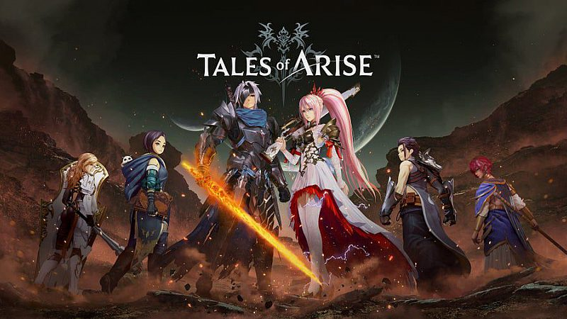

# Tales of Arise

## Het volwassen verhaal

* Tales of Arise hoopt, net als Berseria hiervoor, een meer volwassen verhaal te vertellen dan je van de reeks gewend bent. Nu deed Berseria dit vooral met wat ‘edgy’ ontwerpen en wraakzuchtige heldin, maar Arise gooit er direct wat zwaardere thema’s tegenaan. Het begint met racisme en slavernij, gaat door op fascisme en de gestapo, om vervolgens vrolijk verder te gaan met genocide. Nu heeft Tales of altijd verhalen verteld over het moeizaam samen leven van meerdere volkeren, maar dit gaat toch een stapje verder.

* Het zit namelijk zo: er zijn twee werelden, zoals je van de reeks kunt verwachten. De ene wereld, die van de Renan, is technologisch verder gevorderd dan de ander. Met behulp van die technologie hebben de Renan de wereld van de Dahnan gekoloniseerd. Om energie te genereren, buiten ze zowel de wereld als de bevolking van Dahna uit. De Renan teren zelfs vrij letterlijk op de levens van de Dahnan. Uiteraard is het aan jou om die racistische hiërarchie om te gooien.

### De personages

* Wat hier zeker bij helpt, is dat de helden van Arise bijzonder sterk zijn uitgewerkt. Tuurlijk: ze bestaan weer uit exact dezelfde stereotypen die we al talloze keren hebben gezien. Maar de interacties tussen de personages zijn grappig, ontwapenend en soms zelfs verdomd schattig. De gehele cast is ditmaal ook erg degelijk ingesproken - zelfs in het Engels. Daarbij zijn hun achtergrondverhalen grotendeels geloofwaardig uitgewerkt, al zitten er wat gekke sprongen in. Zo gaat Law binnen één cutscene van woedende gestapo, bereid om zelfs z’n bloedeigen pa te verlinken, naar een vrolijk vaderskindje.

* De plot, en daarmee de structuur, is een stuk meer gestroomlijnd dan voorheen. Tales of experimenteerde al eerder met een meer rechtlijnige structuur, maar Arise gaat nog een stapje verder. Er zijn hier vrijwel alleen kleinere (prachtig vormgegeven) gebieden met een flink aantal gangen. Uiteraard is er vooral later in het spel meer te verkennen, maar doorgaans volg je vrij letterlijk het gebaande pad. Zelfs het camerastandpunt is hierop afgestemd en zit ditmaal veel dichter op je personage. Het resultaat geeft wat minder bewegingsvrijheid, maar het houdt de vaart er wel lekker in.
  
* Waar de rest van het spel je bewegingsvrijheid beperkt, geeft het gevechtssysteem je juist de vrije loop. Een boel van de systemen die je kent uit eerdere games zijn ook hier aanwezig: elk personage heeft nog steeds een bepaald aantal normale aanvallen per combo, en wat constant genererende actiepunten voor spreuken of speciale vaardigheden. Het verschil zit ‘em in hoe strak de directe actie nu is. Voor het eerst is het vatbaar om strategisch te ontwijken en een tegenaanval te doen na een ‘perfect dodge’. Het jongleren met je vijand door een uppercut op te volgen met verschillende luchtaanvallen kon altijd al, maar dit is de eerste keer dat je dat gecontroleerd kan doen. Elke beweging voelt opzettelijk en er zich gewicht achter elke klap.
  
#### De combat in Tales of Arise

* Dat wil overigens niet zeggen dat de combat in Tales of Arise niet uiteindelijk uitmondt in één grote flitsende chaos. Ook hier worden gevechten een hels kabaal doordat al je handlangers elke spreuk of gedachte de lucht in schreeuwen. En ook hier vliegen de speciale effecten je om de oren. Maar zelfs die chaos is onder controle te brengen. Zodra je één vijand overweldigt met aanvallen, kun je een ontzettend krachtige ‘strike-aanval’ er op los laten, waarbij je een toffe animatie te zien krijgt en een paar seconden rust hebt, voor de boel weer losbarst.

* Al je teamgenoten hebben daarnaast hun eigen specialiteit. Niet alleen is de ene beter in helen, en kan de ander effectiever klappen vangen. Ook hebben ze stuk voor stuk toegang tot een herlaadbare speciale aanval die je elk in een andere situatie toe moet passen. Zo kan Law met zijn aanval door schilden beuken, en kan Kisara haar schild juist gebruiken om een aanval te stoppen. De magiër Rimwell kan op haar beurt weer vijandige spreuken stoppen en deze zelfs tegen de vijand gebruiken. Deze acties voelen in eerste instantie, zeker bij de baasgevechten waarin ze worden geïntroduceerd, ietwat gimmicky. Maar in latere gevechten en op hogere moeilijkheidsgraden, kan het verkeerd inzetten van deze acties je de winst kosten. En op een lagere moeilijkheidsgraad zorgt het in ieder geval dat je gehele party aan het gevecht bijdraagt - zelfs als ze niet in je actieve team zitten.

##### Het oordeel

* Het is vooral de uitstekende en bevredigende combat die Tales of Arise zich laat onderscheiden van zijn voorgangers. De combat is strak, en net tactisch genoeg om interessant te blijven. Maar ook de meer gestroomlijnde plot, hoe onhandig het ook met zijn zware thematiek omgaat, is effectief genoeg om je bij de lurven te vatten en niet meer los te laten. Het zal je waarschijnlijk weinig leren over, of laten reflecteren op, de gruwelen van rassen- en klassenongelijkheid. Wel zet in ieder geval een fantasiewereld neer waar je voor wil vechten. En uiteindelijk is dat precies wat een Tales of game moet doen.

[Trailer Tales of Arise](https://www.youtube.com/watch?v=2g3XPcVSX_A)
